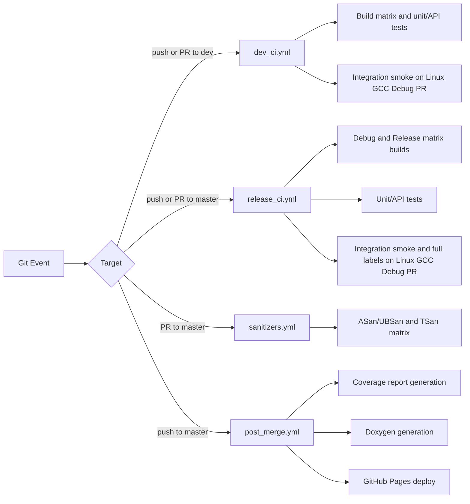

# CI And Quality Workflows

This repository uses four GitHub Actions workflows.

## Workflow Map

## Quick Reference

| Workflow         | Trigger             | Purpose                                         |
| ---------------- | ------------------- | ----------------------------------------------- |
| `dev_ci.yml`     | Push/PR on `dev`    | Fast branch validation and cache seeding        |
| `release_ci.yml` | Push/PR on `master` | Release-gate matrix validation                  |
| `sanitizers.yml` | PR on `master`      | Runtime memory/UB/thread diagnostics            |
| `post_merge.yml` | Push on `master`    | Coverage + docs generation and Pages deployment |

## Caching Strategy

- vcpkg directory cache is used for Windows jobs.
- vcpkg binary cache (`VCPKG_BINARY_SOURCES`) is enabled in CI to avoid rebuilding unchanged packages.
- FetchContent `_deps` cache is used across Linux and Windows presets.

## Test Selection In CI

- Unit/API tests run with `-LE integration` in main build workflows.
- Integration tests are label-driven:
  - `integration_public_smoke`
  - `integration_public_full`
  - umbrella label: `integration`

See [INTEGRATION_TESTS.md](INTEGRATION_TESTS.md) for exact commands and broker override options.
